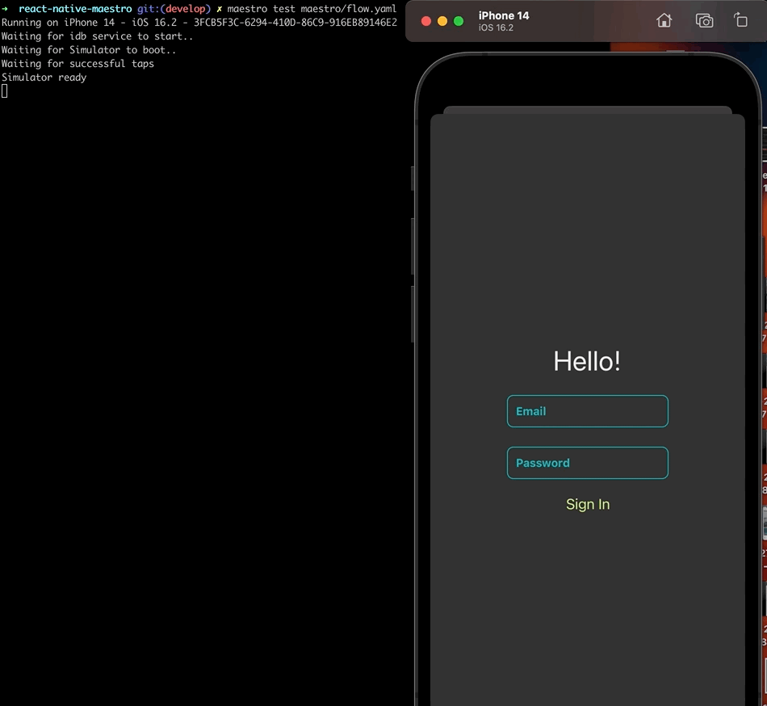
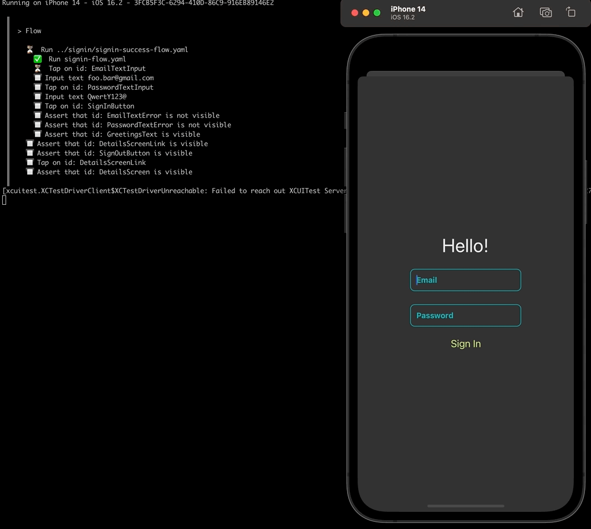

# Mobile UI testing with React Native and Maestro

## Introduction

I started this project mainly for fun and to develop my mobile UI testing skills. After reading the [Documentation for Maestro](https://maestro.mobile.dev/) and [Maestro with React Native](https://maestro.mobile.dev/platform-support/react-native), I found it seemed easy to implement, simple and effective. So... Let's go! :D
I created a React Native app built with Expo to simply this part. The aim of this project is `Maestro`.
Enjoy it! :)

This app has three screens:

- A sign in interface with two fields, email and password. After clicking the sign in button, if the form is valid `(a valid email and password)` we'll see the next screen.
- A simple screen with greetings and email user, a link to another screen and a sign out button.
- A scrollview screen with some texts and images. It's also possible to go back to the previous screen.


## Installation

### React Native Maestro

```shell
$ git clone https://github.com/kiki-le-singe/react-native-maestro.git <name>
$ cd <name>
$ npm install
```

### Maestro

```shell
$ curl -Ls "https://get.maestro.mobile.dev" | bash
$ maestro -v
```

> Only for iOS: [Connecting to Your Device](https://maestro.mobile.dev/getting-started/installing-maestro#connecting-to-your-device)

```shell
$ brew tap facebook/fb
$ brew install facebook/fb/idb-companion
```

See the official documentation: [Installing Maestro](https://maestro.mobile.dev/getting-started/installing-maestro)

## Run

```bash
$ npm start
$ npm run ios or android
```

## Maestro tests

The tests are in the `maestro` directory. You can run them locally in your iOS simulator or Android emulator. At the moment, Maestro does not support real iOS devices. See [Installing Maestro](https://maestro.mobile.dev/getting-started/installing-maestro) and [Connecting to Your Device](https://maestro.mobile.dev/getting-started/installing-maestro#connecting-to-your-device)

You can run the tests in CI with `Maestro Cloud`. See [Running Flows on CI](https://maestro.mobile.dev/getting-started/running-flows-on-ci).

### Running tests

```bash
# run single test
$ maestro test maestro/[fileName].yaml
```

<br />

```bash
$ maestro test maestro/simple-flow.yaml
```



<br /><br />

```bash
$ maestro test maestro/signin/signin-errors-flow.yaml
```


<br /><br />

```bash
$ maestro test maestro/signin/signin-success-flow.yaml
```


<br /><br />

```bash
$ maestro test maestro/home/home-flow.yaml
```



<br />

> Sometimes you could see this error: [Failed to reach out XCUITest Server](https://github.com/mobile-dev-inc/maestro/issues/880)... Maybe your component is not reachable, so you probably check your code. Sometimes the CLI just seems a little capricious... So just wait a few secondes... And it perfectly works! :D

## Resources

- [Maestro Documentation](https://maestro.mobile.dev)
- [Maestro GitHub Repository](https://github.com/mobile-dev-inc/maestro)
- [Maestro with React Native](https://maestro.mobile.dev/platform-support/react-native)
- [Maestro Cloud Documentation](https://cloud.mobile.dev)
- [A great and complete introduction to Maestro with React Native](https://dev.to/b42/test-your-react-native-app-with-maestro-5bfj)
